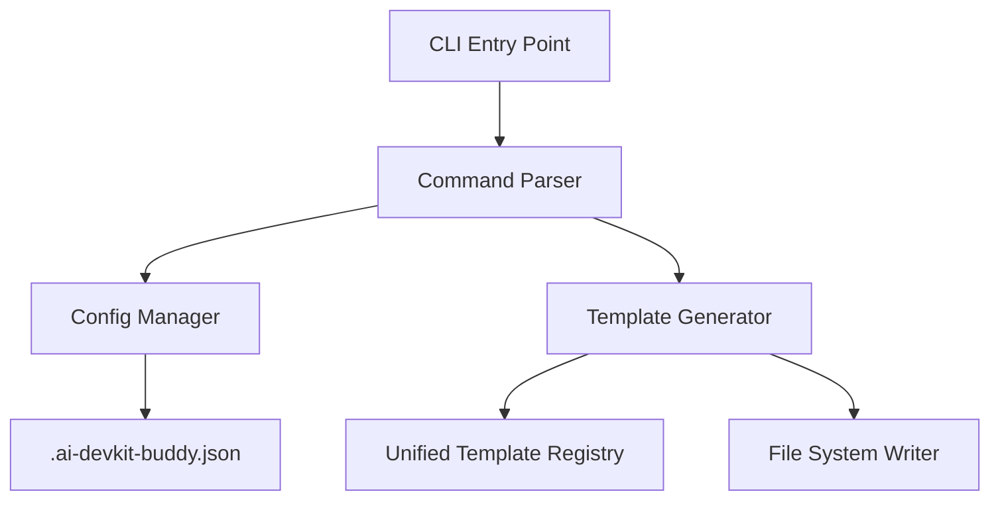

# AI-DevKit Buddy Design Specification

## 1. Overview

`ai-devkit-buddy` is an npm package designed to streamline the setup of AI agent instructions (prompts) in software projects. It generates standardized prompt templates for various development phases, compatible with agents like Cursor and Claude Code.

## 2. Goals

- **Simplicity**: Easy to use CLI with intuitive flags.
- **Unified Experience**: Single set of templates adaptable to different environments.
- **Traceability**: Track setup state via a config file.

## 3. Architecture



## 4. Technical Specification

### 4.1. Technology Stack

- **Language**: TypeScript (Node.js)
- **CLI Framework**: `cac`.
- **Interactivity**: `@inquirer/prompts`.
- **File Operations**: `fs-extra`.

### 4.2. Core Commands

#### `init`

Initializes the devkit in the current repository.

```bash
npx ai-devkit-buddy init [options]
```

**Options:**

- `-e, --environment <env>`: Specify environment (`cursor` | `claude` | `both`).
- `-a, --all`: Initialize all phases at once.
- `-p, --phases <phases>`: Comma-separated list of specific phases (e.g., `requirements,design,planning`).

**Example Usage:**

```bash
# Interactive mode
npx ai-devkit-buddy init

# Specific setup
npx ai-devkit-buddy init -e cursor -p requirements,design
```

### 4.3. Directory Structure (Package)

```
ai-devkit-buddy/
├── bin/
│   └── cli.js
├── src/
│   ├── commands/
│   ├── templates/    # Unified templates
│   │   ├── requirements.md
│   │   ├── design.md
│   │   ├── planning.md
│   │   ├── coding.md
│   │   └── review.md
│   ├── utils/
│   └── index.ts
```

### 4.4. Template Management

Templates are unified. The generator will adapt them if necessary for the specific environment.

### 4.5. Tracking Setup

The tool generates a `.ai-devkit-buddy.json` file to track the configuration.

**Schema:**

```json
{
  "version": "0.2.0",
  "environment": "cursor",
  "initializedPhases": ["requirements", "design"],
  "createdAt": "2025-10-14T...",
  "updatedAt": "2025-10-14T..."
}
```

## 5. User Workflow

1.  User runs `init` with flags or interactively.
2.  CLI reads/creates `.ai-devkit-buddy.json`.
3.  CLI generates selected phase templates into the appropriate location for the environment.
    - **Cursor**: `.cursor/commands/<phase>.md`
    - **Claude**: `.claude/commands/<phase>.md`
    - **GitHub**: `.github/prompts/<phase>.md` (Future)
4.  User sees a success message and log update.
